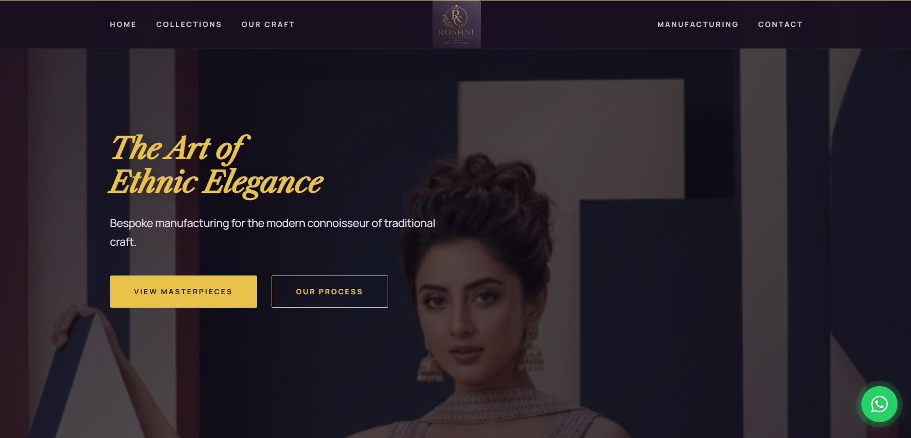
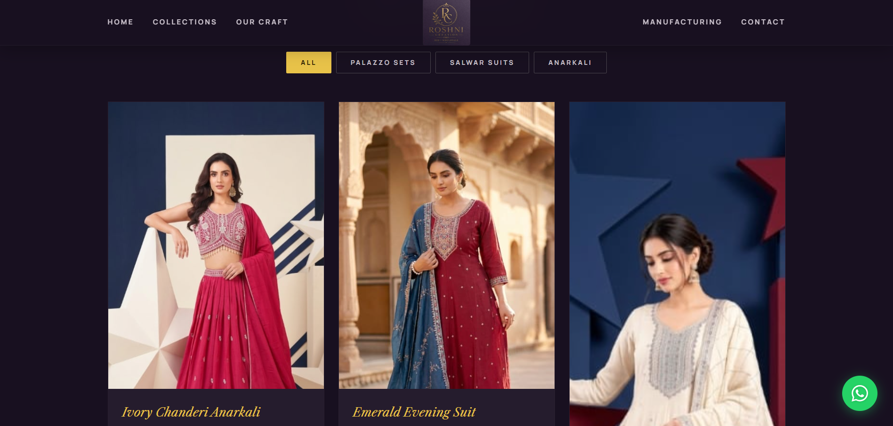
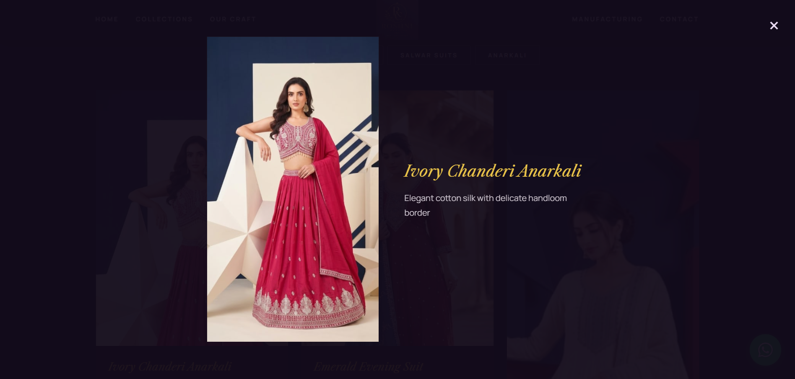
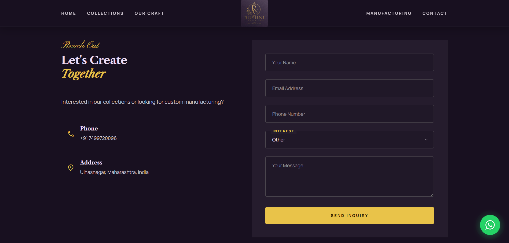
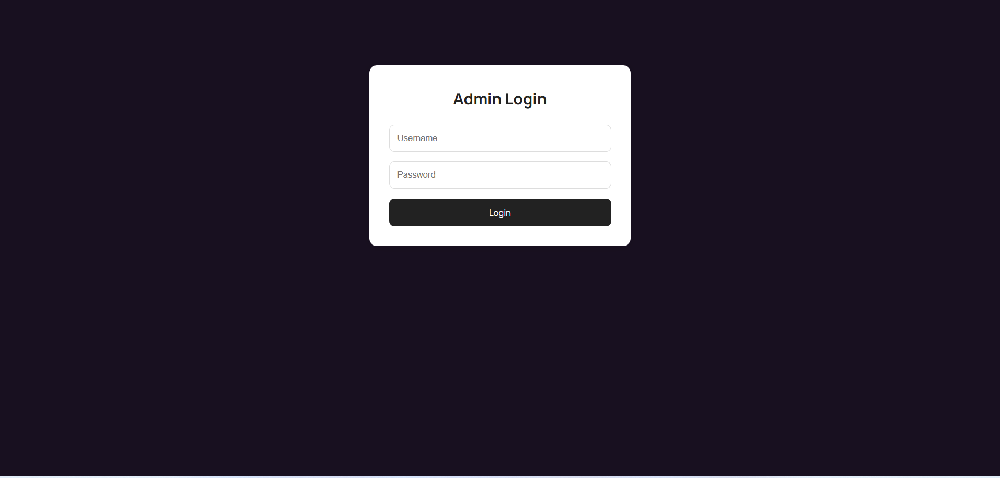
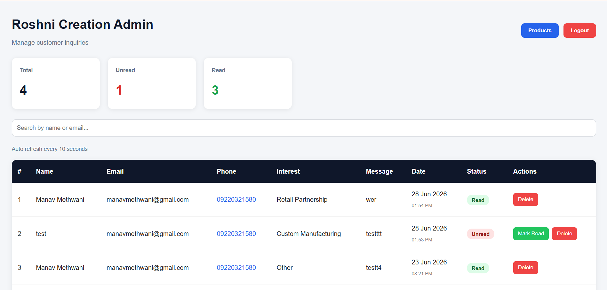
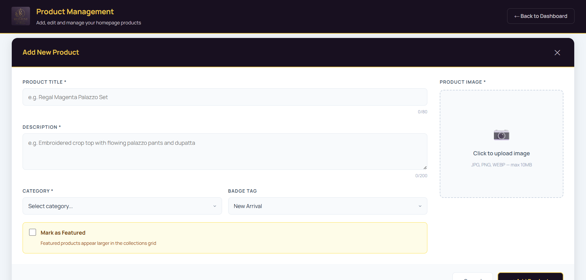
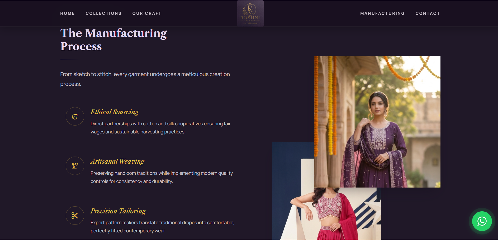
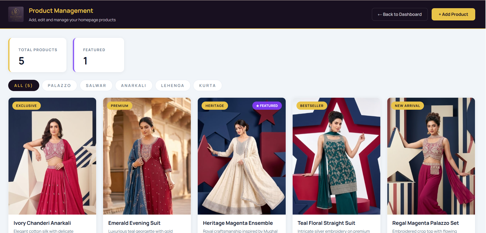

# 🌸 Roshni Creation


A full-stack business website built using the MEAN stack, designed for managing products and customer inquiries. The application features a responsive user interface, secure admin dashboard, cloud-based image storage, and live deployment.

---

## 🚀 Live Demo

🌐 Website: https://roshni-creation-theta.vercel.app/

---

## ✨ Features

- Responsive business website
- Product catalog
- Product details page
- Customer inquiry form
- Secure admin authentication
- Admin dashboard
- Add, edit and delete products
- Cloudinary image upload
- MongoDB Atlas integration
- RESTful API architecture

---

## 🛠 Tech Stack

### Frontend
- Angular
- TypeScript
- Bootstrap
- HTML5
- CSS3

### Backend
- Node.js
- Express.js

### Database
- MongoDB Atlas

### Cloud Services
- Cloudinary

### Deployment
- Vercel
- Render

---

## 📂 Project Structure

```
roshni-creation/
│
├── frontend/
│
├── backend/
│
└── README.md
```

---

## ⚙️ Installation

### Clone Repository

```bash
git clone <repository-url>
```

### Backend

```bash
cd backend
npm install
npm start
```

### Frontend

```bash
cd frontend
npm install
ng serve
```

---

## 📸 Screenshots

### 🏠 Home Page


### 📦 Products


### 📄 Product Details


### 📝 Inquiry Form


### 🔐 Admin Login


### 📊 Admin Dashboard


### ➕ Add Product


### ⚙️ Process


### ✅ Products Uploaded


---

## 📈 Future Improvements

- Product search
- Category filtering
- Dashboard analytics
- Email notifications
- Pagination
- Order management

---

## 👨‍💻 Author

**Manav Methwani**

Computer Engineering Student

Mumbai, India
